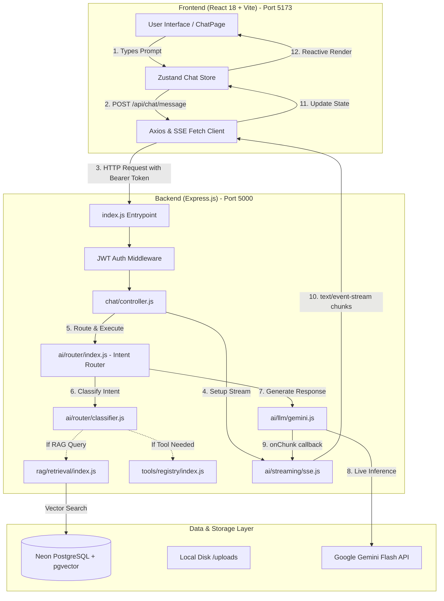
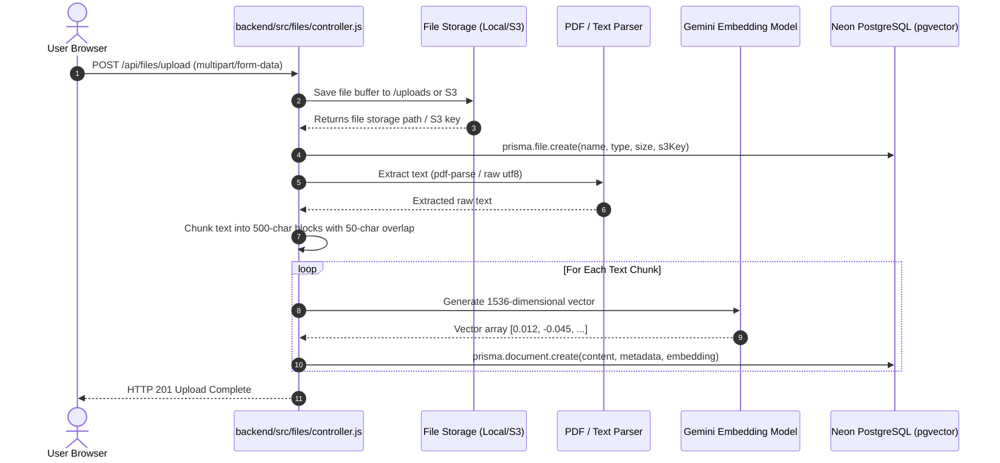

# System Architecture & Execution Flow
**Project:** MiniGPT / AkashAgent  
**Last Updated:** September 15, 2026  
**Document Purpose:** Complete end-to-end execution flow, startup lifecycle, function call graphs, and session modifications log.

---

## 📑 Table of Contents
1. [High-Level Architecture Diagram](#1-high-level-architecture-diagram)
2. [Application Entry Points](#2-application-entry-points)
   - [2.1 Backend Entry Point](#21-backend-entry-point)
   - [2.2 Frontend Entry Point](#22-frontend-entry-point)
3. [End-to-End Execution Flows & Function Call Graphs](#3-end-to-end-execution-flows--function-call-graphs)
   - [3.1 Chat & Streaming Inference Flow (The Core AI Loop)](#31-chat--streaming-inference-flow-the-core-ai-loop)
   - [3.2 User Authentication Flow (Register & Login)](#32-user-authentication-flow-register--login)
   - [3.3 Document Ingestion & pgvector RAG Indexing Flow](#33-document-ingestion--pgvector-rag-indexing-flow)
   - [3.4 Memory Bank Extraction & Fact Storage Flow](#34-memory-bank-extraction--fact-storage-flow)
4. [Session Modifications: Code Changed by AI](#4-session-modifications-code-changed-by-ai)
   - [Summary Table of Modified Files](#summary-table-of-modified-files)
   - [Deep Dive into Each Code Change](#deep-dive-into-each-code-change)

---

## 1. High-Level Architecture Diagram



---

## 2. Application Entry Points

### 2.1 Backend Entry Point
- **File:** [`backend/src/index.js`](file:///c:/AkashAgent/backend/src/index.js)
- **Start Command:** `npm run dev` (executes `nodemon src/index.js`)

#### Startup Sequence:
1. **Environment Initialization**: Imports [`config/env.js`](file:///c:/AkashAgent/backend/src/config/env.js) which executes `dotenv.config()` and validates critical secrets (`PORT`, `DATABASE_URL`, `JWT_SECRET`, `GEMINI_API_KEY`).
2. **App Instantiation**: Initializes Express: `const app = express()`.
3. **Core Middleware Attachment**:
   - `app.set('trust proxy', 1)`: Configures reverse proxy trust for deployment on Render/Vercel.
   - `requestIdMiddleware`: Injects a unique `X-Request-ID` into every incoming request.
   - `cors(...)`: Validates origin whitelist (`localhost:5173`, `.vercel.app`, `.onrender.com`).
   - `express.json({ limit: '2mb' })` & `express.urlencoded`: Parses JSON request payloads.
   - `express.static`: Serves local document uploads from `/uploads`.
4. **Health Check**: Exposes `GET /api/health` returning server status and timestamp.
5. **Route Mounting**:
   - `/api/auth` ➡️ [`authRoutes`](file:///c:/AkashAgent/backend/src/auth/routes.js) (guarded with 30-req/15min rate limiting)
   - `/api/chat` ➡️ [`chatRoutes`](file:///c:/AkashAgent/backend/src/chat/routes.js)
   - `/api/files` ➡️ [`fileRoutes`](file:///c:/AkashAgent/backend/src/files/routes.js)
   - `/api/user` & `/api/users` ➡️ [`userRoutes`](file:///c:/AkashAgent/backend/src/users/routes.js) *(Mounted dual routes in this session)*
6. **Fallback & Error Handling**:
   - `app.use('/api/*', ...)`: 404 JSON responder.
   - `errorHandler`: Global Express error handling interceptor.
7. **Port Listener**: Binds to `PORT 5000` via `app.listen()`.

---

### 2.2 Frontend Entry Point
- **HTML Container:** [`frontend/index.html`](file:///c:/AkashAgent/frontend/index.html)
- **JS Bootstrapper:** [`frontend/src/main.jsx`](file:///c:/AkashAgent/frontend/src/main.jsx)
- **Start Command:** `npm run dev` (launches Vite dev server on `http://localhost:5173`)

#### Startup Sequence:
1. **Zombie Service Worker & Cache Purge** *(Added in this session)*:
   - Checks `navigator.serviceWorker.getRegistrations()` and immediately unregisters foreign/stale service workers from other projects sharing port 5173.
   - Deletes all entries in `window.caches` to prevent stale PWA assets from hijacking the DOM.
2. **Theme Hydration**: Reads `minigpt_theme` (`light`/`dark`) from `localStorage` and sets `data-theme` attribute on `document.documentElement` before first paint to prevent UI flicker.
3. **DOM Mount**: Renders root component `<App />` into `#root` wrapped in `<React.StrictMode>`.
4. **Routing & Layout Initialization**:
   - [`App.jsx`](file:///c:/AkashAgent/frontend/src/App.jsx) establishes `<BrowserRouter>` and defines paths:
     - `/` ➡️ `ChatPage`
     - `/files` ➡️ `FilesPage`
     - `/knowledge` ➡️ `KnowledgePage`
     - `/settings` ➡️ `SettingsPage`
     - `/login` & `/register` ➡️ Auth pages
   - Protected routes are wrapped in `<AuthGuard>` which validates tokens via [`authStore.js`](file:///c:/AkashAgent/frontend/src/store/authStore.js).

---

## 3. End-to-End Execution Flows & Function Call Graphs

### 3.1 Chat & Streaming Inference Flow (The Core AI Loop)

This is the primary pipeline executed when a user sends a message in the chat interface.

```
[User Types in ChatInput.jsx]
       │
       ▼
useChatStore.sendMessage(text, attachedFile)
       │
       ▼
fetch('/api/chat/message') [POST + Authorization: Bearer <token>]
       │
       ▼
backend/src/index.js (Express Route Match)
       │
       ▼
backend/src/middleware/auth.js: authenticateToken()
       │ verifies JWT signature, attaches req.user
       ▼
backend/src/chat/controller.js: sendMessage()
       ├── 1. Generates or fetches conversationId from prisma.conversation
       ├── 2. Queries previous 12 messages from prisma.message (context history)
       ├── 3. Calls setupSSEStream(res) to write headers:
       │      Content-Type: text/event-stream
       │      Cache-Control: no-cache
       │      Connection: keep-alive
       ▼
backend/src/ai/router/index.js: routeAndExecute()
       │
       ├──► Step A: classifyUserIntent(userMessage)
       │    └── Evaluates query against pattern matchers & keyword weights
       │        Returns: { pipeline: 'chat'|'rag'|'tool'|'hybrid', reasoning, toolsNeeded }
       │
       ├──► Step B: Sends SSE 'meta' event to frontend
       │    └── onMetaData({ routerType, reasoning, toolsUsed })
       │
       ├──► Step C: Pipeline Branching:
       │    ├── If TOOL: executeTools(toolsNeeded) -> Calculator / Weather / SerpAPI
       │    ├── If RAG: retrieveRelevantChunks() -> PostgreSQL cosine similarity (<=>)
       │    │           rerankChunks() -> sorts by relevance score
       │    └── If CHAT: injects user profile + conversation history
       │
       ├──► Step D: generateLLMResponse() [ai/llm/provider.js]
       │    └── Dispatches to selected provider (defaults to 'gemini')
       │
       ▼
backend/src/ai/llm/gemini.js: generateGeminiResponse()
       │
       ├──► Iterates through active modelsToTry:
       │    1. 'gemini-flash-lite-latest' (Primary)
       │    2. 'gemini-3.5-flash-lite'
       │    3. 'gemini-flash-latest'
       │
       ├──► SDK Call: model.startChat().sendMessageStream(prompt)
       │    (or model.generateContentStream(prompt))
       │
       ▼
Stream Loop:
       for await (const chunk of result.stream) {
           const text = chunk.text();
           onChunk(text); ──────────────────────────────┐
       }                                                │
                                                        ▼
backend/src/chat/controller.js                  SSE write:
res.write(`data: ${JSON.stringify({ type: 'token', token })}\n\n`)
                                                        │
                                                        ▼
frontend/src/store/chatStore.js                 Browser Stream Reader:
reader.read() receives chunk -> updates active assistant message in Zustand
                                                        │
                                                        ▼
frontend/src/features/chat/MessageBubble.jsx     Reactive UI Re-render!
```

---

### 3.2 User Authentication Flow (Register & Login)

#### Registration Call Chain:
1. **User Action**: Submits name, email, password on `RegisterForm.jsx`.
2. **Frontend API**: Calls `registerApi(name, email, password)` in [`frontend/src/api/auth.js`](file:///c:/AkashAgent/frontend/src/api/auth.js).
3. **Backend Route**: `POST /api/auth/register` matched in [`backend/src/auth/routes.js`](file:///c:/AkashAgent/backend/src/auth/routes.js).
4. **Rate Limiting**: Passes through `authLimiter` (max 30 requests / 15 minutes).
5. **Controller**: [`backend/src/auth/controller.js: register()`](file:///c:/AkashAgent/backend/src/auth/controller.js#L7):
   - Validates input format and email regex: `/^[^\s@]+@[^\s@]+\.[^\s@]+$/`.
   - Checks if user exists via `prisma.user.findUnique({ where: { email } })`.
   - Generates salt & hash: `const hashedPassword = await bcrypt.hash(password, 10)`.
   - Generates DiceBear robotic avatar URL.
   - **DB Insertion**: `await prisma.user.create({ data: { email, name, hashedPassword, avatar } })`.
   - **Token Generation**: `jwt.sign({ id, email, name }, env.JWT_SECRET, { expiresIn: '7d' })`.
   - Responds with `{ success: true, token, user }`.
6. **Frontend State**: `useAuthStore.setAuth(user, token)` persists credentials in `localStorage` and transitions user directly into the chat workspace.

---

### 3.3 Document Ingestion & pgvector RAG Indexing Flow



---

### 3.4 Memory Bank Extraction & Fact Storage Flow

1. After an assistant response finishes streaming in [`chat/controller.js`](file:///c:/AkashAgent/backend/src/chat/controller.js#L140):
2. Asynchronously invokes `extractMemoriesFromConversation(conversationHistory)` without blocking the HTTP response.
3. The extraction engine prompts the model to detect long-term facts (e.g., *"User prefers Python"*, *"User is studying database indexing"*).
4. Extracted facts are stored via `saveMemory(fact, category, userId)` into the `Memory` table in PostgreSQL.
5. In future chats, `getUserMemories(userId)` automatically injects these facts into the system prompt, giving the AI persistent long-term memory across sessions.

---

## 4. Session Modifications: Code Changed by AI

During this debugging and architectural stabilization session, **7 files** were modified to resolve startup crashes, routing 404s, database schema validation errors, and AI fallback issues.

### Summary Table of Modified Files

| File Path | Component | Type of Change | Key Purpose |
|---|---|---|---|
| [`frontend/src/main.jsx`](file:///c:/AkashAgent/frontend/src/main.jsx) | Frontend Core | Resilience / Bug Fix | Purges foreign/zombie Service Workers & caches on `localhost:5173`. |
| [`backend/src/index.js`](file:///c:/AkashAgent/backend/src/index.js) | Server Router | API Compatibility | Mounts `userRoutes` at both `/api/user` and `/api/users`. |
| [`backend/src/users/routes.js`](file:///c:/AkashAgent/backend/src/users/routes.js) | Users Module | REST Aliasing | Added `GET /me` alias pointing to `getProfile`. |
| [`backend/src/auth/controller.js`](file:///c:/AkashAgent/backend/src/auth/controller.js) | Auth Controller | Schema Alignment | Fixed `passwordHash` ➡️ `hashedPassword` to match Prisma model. |
| [`backend/src/ai/llm/gemini.js`](file:///c:/AkashAgent/backend/src/ai/llm/gemini.js) | LLM Client | Model Migration | Switched from deprecated 1.5/2.0 models to active `gemini-flash-lite-latest`. |
| [`backend/src/shared/constants.js`](file:///c:/AkashAgent/backend/src/shared/constants.js) | Shared Constants | Default Config | Updated `DEFAULT_MODELS.GEMINI` to `gemini-flash-lite-latest`. |
| [`backend/src/ai/router/index.js`](file:///c:/AkashAgent/backend/src/ai/router/index.js) | Intent Router | DB Query Fix | Removed invalid `chunkCount` column from `prisma.file.findMany` select. |
| [`backend/src/chat/controller.js`](file:///c:/AkashAgent/backend/src/chat/controller.js) | Chat Controller | Bug Fix / Memory | Fixed `MessageRole` enum casing (`USER`/`ASSISTANT`) so conversation history persists. |
| [`frontend/src/features/chat/MessageBubble.jsx`](file:///c:/AkashAgent/frontend/src/features/chat/MessageBubble.jsx) | Chat UI | UI Resilience | Normalized role casing check for message bubble styles. |

---

### Deep Dive into Each Code Change

#### 1. [`frontend/src/main.jsx`](file:///c:/AkashAgent/frontend/src/main.jsx#L6-L23)
- **Problem**: Stale service worker from another project (`Budget-tracker`) on `localhost:5173` intercepted network requests, crashed on Chrome Extension schemes, and tried to connect to dead WebSockets.
- **Before**: Only initialized theme and called `ReactDOM.createRoot()`.
- **After**:
  ```javascript
  if (typeof window !== 'undefined') {
    if ('serviceWorker' in navigator) {
      navigator.serviceWorker.getRegistrations().then((registrations) => {
        for (const registration of registrations) registration.unregister();
      }).catch(() => {});
    }
    if ('caches' in window) {
      caches.keys().then((names) => {
        for (const name of names) caches.delete(name);
      }).catch(() => {});
    }
  }
  ```

#### 2. [`backend/src/index.js`](file:///c:/AkashAgent/backend/src/index.js#L92-L93) & [`backend/src/users/routes.js`](file:///c:/AkashAgent/backend/src/users/routes.js#L10)
- **Problem**: UI components requested `/api/users/memories` and `/api/users/me`, but Express was mounted exclusively at `/api/user` (singular), resulting in 404 `ROUTE_NOT_FOUND`.
- **After**:
  ```javascript
  // backend/src/index.js
  app.use('/api/user', userRoutes);
  app.use('/api/users', userRoutes);

  // backend/src/users/routes.js
  router.get('/profile', getProfile);
  router.get('/me', getProfile);
  ```

#### 3. [`backend/src/auth/controller.js`](file:///c:/AkashAgent/backend/src/auth/controller.js#L66-L74)
- **Problem**: Prisma schema defines column `hashedPassword String`. Controller passed `passwordHash: hashedPassword`. Prisma rejected with `Argument 'hashedPassword' is missing`.
- **After**:
  ```javascript
  user = await prisma.user.create({
    data: {
      email: cleanEmail,
      name: name.trim(),
      hashedPassword: hashedPassword, // Matches schema.prisma exactly
      avatar
    },
    select: { id: true, email: true, name: true, avatar: true, createdAt: true }
  });
  ```

#### 4. [`backend/src/ai/llm/gemini.js`](file:///c:/AkashAgent/backend/src/ai/llm/gemini.js#L22-L30) & [`backend/src/shared/constants.js`](file:///c:/AkashAgent/backend/src/shared/constants.js#L19)
- **Problem**: Hardcoded model names (`gemini-1.5-flash-latest`, `gemini-1.5-flash`, `gemini-2.0-flash-exp`) were deprecated by Google API, returning 404s and forcing the app to fall back to the canned offline text string in `smartFallback.js`.
- **After**:
  ```javascript
  // Active Google Gemini models in priority order
  const modelsToTry = [
    ...(cachedWorkingModel ? [cachedWorkingModel] : []),
    'gemini-flash-lite-latest', // Primary: super-fast streaming & high quota
    'gemini-3.5-flash-lite',
    'gemini-flash-latest',
    'gemini-3.8-flash',
    'gemini-3.7-flash',
    'gemini-3.6-flash'
  ].filter((v, i, a) => a.indexOf(v) === i);
  ```

#### 5. [`backend/src/ai/router/index.js`](file:///c:/AkashAgent/backend/src/ai/router/index.js#L49)
- **Problem**: Prisma query on `prisma.file.findMany` requested `chunkCount: true`. `chunkCount` does not exist on the `File` model, causing Prisma query warnings.
- **After**: Replaced with `select: { id: true, name: true, size: true, type: true }`.

#### 6. [`backend/src/chat/controller.js`](file:///c:/AkashAgent/backend/src/chat/controller.js#L64-L100)
- **Problem**: Prisma `MessageRole` is an uppercase enum (`USER`, `ASSISTANT`). Controller inserted lowercase strings (`role: 'user'`, `role: 'assistant'`), which caused Prisma validation to silently fail. Zero messages were saved to the DB, which broke conversation memory and caused multi-turn follow-up prompts (e.g. *"in short me bol na"*) to lose all context.
- **After**: Changed database insertions to `role: 'USER'` and `role: 'ASSISTANT'`, normalized `history` roles to lowercase for providers, and normalized `conversation.messages` in `getConversationById`.

#### 7. [`frontend/src/features/chat/MessageBubble.jsx`](file:///c:/AkashAgent/frontend/src/features/chat/MessageBubble.jsx#L65)
- **Problem**: Frontend strictly checked `message.role === 'user'`, failing if the database returned uppercase `USER`.
- **After**: Changed to `(message.role || '').toLowerCase() === 'user'` for resilient rendering.

